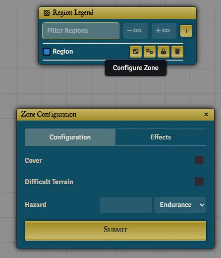
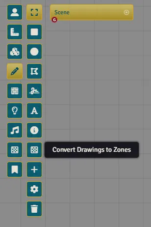

Zones are implemented via [Scene Regions](https://foundryvtt.com/article/scene-regions/). 

Each Region can abe configured with Zone properties via the Region Legend

{: .question}
Is there an easier way to create Zones?

Yes! If you prefer using Drawings to mark up Zones, you can do so, using a conversion tool provided in the Warhammer Library. 

